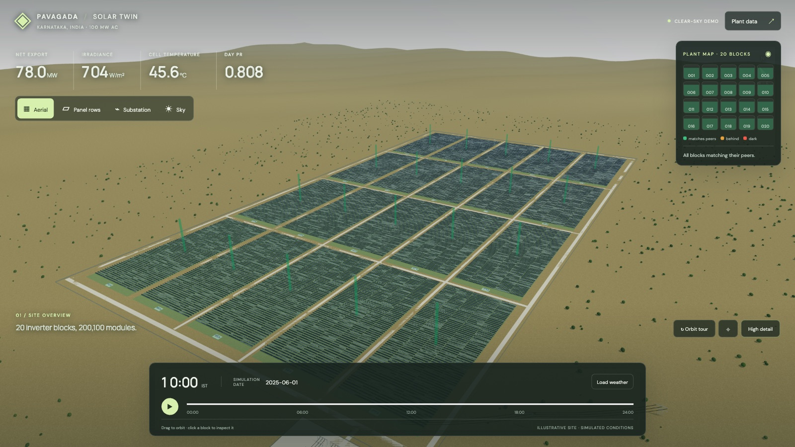
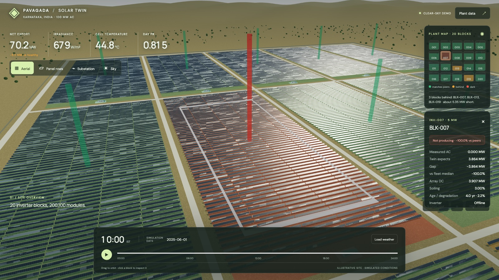
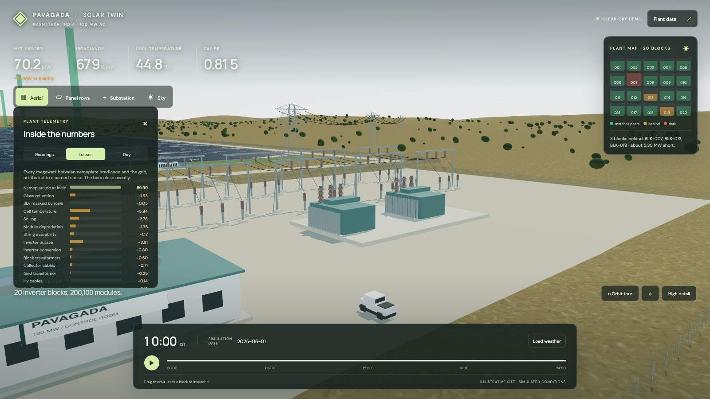
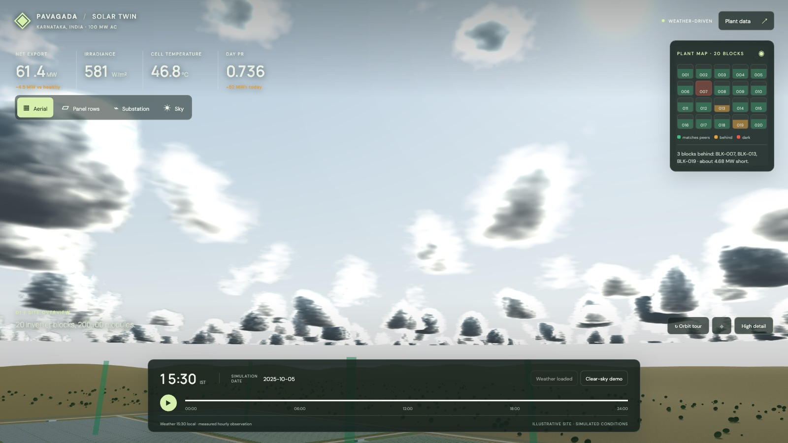
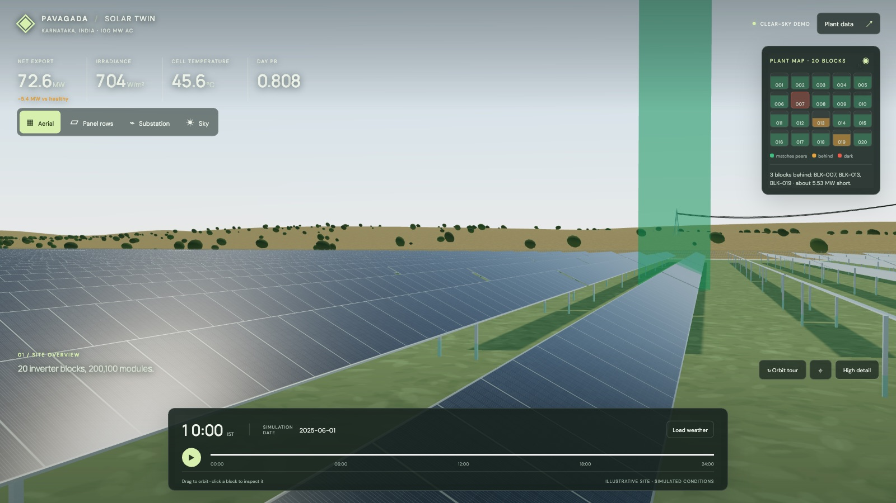
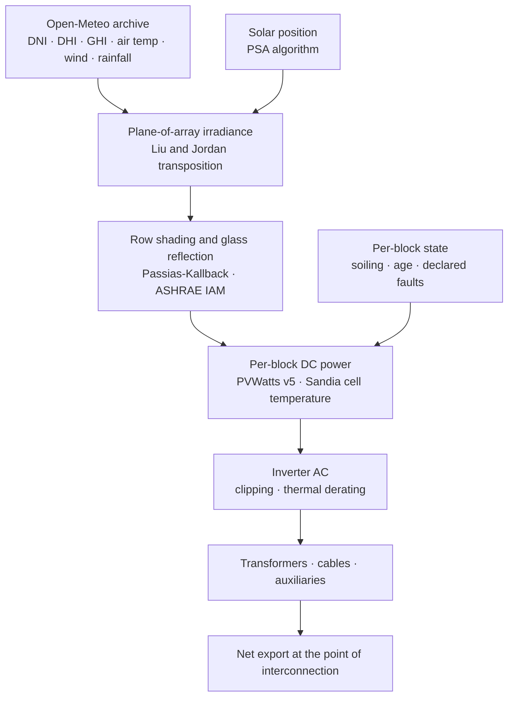
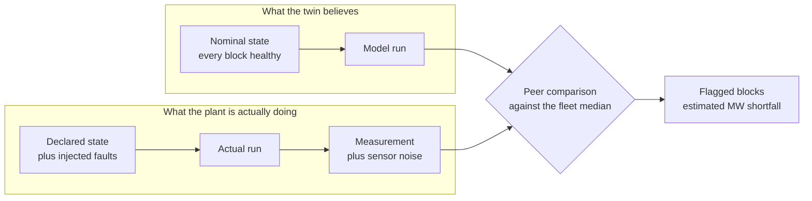

# Solar Plant Digital Twin

**A physics-based digital twin of a 100 MW photovoltaic solar plant — it doesn't
just predict output, it tells you which block is underperforming and why.**

Physics from **pvlib**, the reference library for photovoltaic modelling.
Everything above the physics — per-block asset state, fault detection, the loss
waterfall, the grid cascade, history, the server — is pure standard library.



---

## What makes it a *twin* rather than a simulator

A simulator answers *"what should this plant produce?"*. A twin answers
*"what is this plant producing that it shouldn't be?"*

Every block carries its own state — how dirty it is, how old it is, what's
wrong with it. The model runs **twice** on every timestep: once assuming a
perfectly healthy plant, once under the plant's real declared state. The
difference between them, block by block, is the product.



BLK-007's inverter has tripped — the dark block under the red beacon. The twin
didn't need telling: it compared each block's measured output against the
**fleet median** and found one reading 100% below its peers, worth 3.86 MW.
BLK-013 and BLK-019 are flagged amber on the plant map for a string outage and
a patch of soiling.

Comparing against the *median* rather than a fixed threshold is the whole
trick. If the irradiance input is 12% low, every block reads 12% low — a fixed
threshold would flag all twenty. Dividing by the median cancels anything common
to the plant and leaves only what's specific to one block.

## Every megawatt is accounted for



From nameplate irradiance down to the grid, each loss attributed to a named
cause — glass reflection, sky masked by neighbouring rows, cell temperature,
soiling, degradation, string outages, inverter clipping, transformers, cables,
auxiliaries. Nothing
disappears into an unexplained "derate factor". **The bars close exactly**, to
within 1e-9 MW, and there's a test that proves it.

## It runs on real weather



Real hourly weather for Pavagada, Karnataka from the Open-Meteo archive, and
real rainfall driving a soiling model — so the array gets dirty through the dry
season and washes clean in the monsoon, exactly as the actual site does:

| Date | Fleet soiling | Cleaning storms in the last 45 days |
| --- | --- | --- |
| 20 Feb | 6.89% | 0 |
| 15 May | 4.07% | 2 |
| 10 Sep | 0.00% | 6 |



---

## How it works

The physics pipeline. Every stage is a published, citable model — nothing here
is a fitted curve or an invented fudge factor:



And the twin loop — the bit that turns a model into a diagnosis:



---

## Run it

Python 3.10 or newer.

```bash
pip install -r requirements.txt
python3 -m solar_twin.server
```

Then open <http://127.0.0.1:8000>. Drag to orbit, click any block to inspect
it, and press **Load weather** for a real day at the real site.

Run the test suite — 256 tests:

```bash
python3 -m unittest discover -s tests
```

---

## On the physics

Every physics model here comes from pvlib: SPA solar position, Perez
transposition, Ineichen clear sky, Sandia cell temperature, PVWatts DC,
Passias row shading, ASHRAE incidence-angle losses, Kimber soiling.

It didn't start that way. The whole project was originally written stdlib-only,
each model coded from its published paper. Adopting pvlib meant every one of
those could finally be checked against a reference implementation — and that
turned out to be the most useful thing it bought:

| Model | Agreement with pvlib |
| --- | --- |
| Sandia cell temperature | exact (0.000 °C) |
| PVWatts DC | 1e-13 W |
| Passias row shading | exact to 4 dp across a sunset |
| ASHRAE IAM | exact (0.00e+00) |
| Kimber soiling | exact over 2160 hourly samples |
| PVWatts inverter curve | 4e-16 MW |

Every hand-written model was already right. Those checks are now permanent
tests (`tests/test_pvlib_agreement.py`) so neither side can drift silently.

What genuinely improved: solar position gained atmospheric refraction and about
two orders of magnitude of accuracy; the clear-sky DNI/DHI split went from a
made-up fixed 15% diffuse fraction to a model whose diffuse share actually
varies with sun height (0.19 at noon, 0.57 near sunset); transposition gained
an anisotropic sky. And one term that had simply been missing got added — the
sky each row hides from its neighbour. That had been documented as costing "a
few percent"; measured, it costs **0.22%**, so the note was wrong by an order
of magnitude and is now corrected.

One model stayed hand-written on purpose. `pvlib.inverter.pvwatts` clips at
nameplate, but this project needs the *unclipped* curve to solve backwards from
clipped AC to the DC actually consumed. Swapping it in broke that solve, and
three tests caught it.

## What it models — and what it doesn't

This is the part most simulation projects leave out, so it goes near the top
instead. **Every result carries explicit `warnings` and `assumptions` fields**
describing its own limits, and those propagate all the way to the browser.

**Modelled:** PVWatts v5 DC · Sandia cell temperature · PSA solar position ·
Liu and Jordan transposition · row-to-row shading · ASHRAE incidence-angle
losses · Kimber soiling from real rainfall · module warranty degradation ·
inverter clipping and thermal derating · transformer, cable and auxiliary
losses · export curtailment · energy, specific yield and IEC 61724-1
performance ratio · per-block fault detection · SQLite history.

**Deliberately not claimed:** the plant is fictional and this is not a
certified engineering tool. Clouds are visual only and do not attenuate the
irradiance driving the physics. Every block sees identical weather — no cloud
shadow crosses the site. A block is the finest resolution, so string-level
mismatch and MPPT shifts aren't modelled. Sub-hourly values are interpolated,
which adds resolution but not information. Measurement is synthetic, generated
from a declared fault state, and never presented as real telemetry.

**Full details:** [docs/technical-reference.md](docs/technical-reference.md) —
the complete build, step by step, with the paper behind every model and an
honest account of the bugs found along the way.

---

## Contact

Built by **Likith Muninarakala**.

- Email — <likithmuni.2004@gmail.com>
- GitHub — [@likith-17052004](https://github.com/likith-17052004)

Questions, feedback, or interested in licensing it for commercial use? Get in
touch — I'd genuinely like to hear from you.

## Licence

Copyright © 2026 Likith Muninarakala. **All rights reserved.** See
[LICENSE](LICENSE).

Published for evaluation and reference. It is *not* open source: reading it and
running it locally are fine, anything else needs a written licence. Commercial
licences are available — contact me.

The scientific models implemented here are published, public science and are
not claimed by that copyright; only this implementation of them is. three.js
and Google Fonts load from third-party CDNs at runtime under their own
licences.
